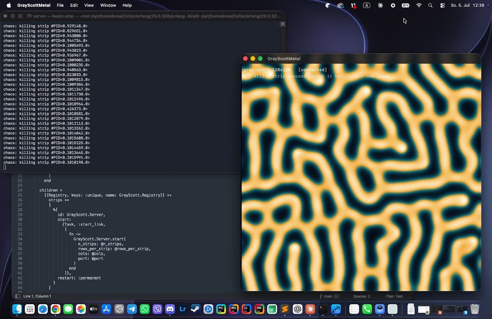

# Gray-Scott: Elixir backend + Swift/Metal frontend

Gray-Scott reaction-diffusion where the grid is **domain-decomposed across
supervised Elixir processes**: 8 horizontal strips, each strip a `GenServer`
owning its rows, halo rows exchanged through messages every simulation step -
the actor version of an MPI stencil computation.

## Screenshot


The **server** is an Elixir node running the simulation. The **client** is a
macOS app rendering the V field over TCP as a Metal texture with a colormap
shader.

The demo: press **K** - a random strip process is killed. Its part of the
pattern vanishes (the supervisor restarts it blank), and then the
reaction-diffusion dynamics **heal the wound** from the neighbouring strips.
Fault tolerance you can literally watch.

Zero external dependencies on both sides: pure Elixir/OTP stdlib, pure
Metal / MetalKit / Network.framework. No Mix project - plain `elixirc`.

```
+-------------------------------+        +---------------------------+
|  server/  (Elixir node)       |  TCP   |  client/  (macOS app)     |
|  Supervisor (one_for_one)     | -----> |  FieldClient (Network)    |
|   +- Strip 0 (GenServer,      | ~26fps |  FieldRenderer (Metal,    |
|   |   16 rows x 128 cols)     | frames |   r8Unorm texture +       |
|   +- Strip 1 ... Strip 7      | <----- |   colormap shader)        |
|   +- Server (gen_tcp)         |  cmds  |  keys: K=chaos, S=seed    |
|  Coordinator: halo exchange,  |        |                           |
|  Task.async per strip         |        +---------------------------+
+-------------------------------+
```

## Layout

```
server/   strip.ex           one grid strip = one supervised GenServer
          coordinator.ex     halo exchange, parallel steps, frame assembly
          server.ex          gen_tcp server, tick loop, commands
          application.ex     supervision tree (Registry + 8 strips + server)
          run.zsh            compiles with elixirc and starts the node
client/   GrayScottApp.swift    SwiftUI shell, HUD
          FieldClient.swift     TCP client, frame parsing, keyboard
          FieldRenderer.swift   texture upload + fullscreen triangle
          Shaders.metal         colormap fragment shader
          build.zsh             builds GrayScottMetal.app without Xcode
```

## Wire protocol

Little-endian:

```
frame = rows :: uint32, cols :: uint32, rows*cols bytes (V field, 0..255)
```

Commands from the client, single bytes:
`0x01` chaos (kill a random strip process), `0x02` drop new seed spots.

## Run

Server (Elixir 1.14+, `brew install elixir`):

```zsh
cd server
./run.zsh          # 128x128 grid, port 4041
```

Client (Command Line Tools are enough, full Xcode not required):

```zsh
cd client
./build.zsh
open build/GrayScottMetal.app
```

The pattern needs a couple of minutes to grow from the initial seeds -
an almost empty field at the start is expected. Press **S** to drop more
seeds, **K** to kill a strip and watch the wound heal.

## Notes

- The hot loop (`Strip.update_cells/12`) is a hand-rolled 10-list recursion
  instead of `Enum.zip/1` - ~3x faster, ~180 sim steps/s on a 128x128 grid.
  Pure-BEAM float math is not the point here; the coordination is.
- `Coordinator` tolerates strips dying between lookup and call
  (`catch :exit`) - the same race as in any distributed system: a pid can
  die between "found" and "called".
- A killed strip restarts in the uniform state (U=1, V=0) by design: the
  supervisor guarantees the process, the physics regrows the data.
- Parameters are the "coral" regime (F=0.055, k=0.062, Du=0.16, Dv=0.08).

## License

MIT License

Copyright (c) 2026 Mykhailo Makarov

Permission is hereby granted, free of charge, to any person obtaining a copy
of this software and associated documentation files (the "Software"), to deal
in the Software without restriction, including without limitation the rights
to use, copy, modify, merge, publish, distribute, sublicense, and/or sell
copies of the Software, and to permit persons to whom the Software is
furnished to do so, subject to the following conditions:

The above copyright notice and this permission notice shall be included in all
copies or substantial portions of the Software.

THE SOFTWARE IS PROVIDED "AS IS", WITHOUT WARRANTY OF ANY KIND, EXPRESS OR
IMPLIED, INCLUDING BUT NOT LIMITED TO THE WARRANTIES OF MERCHANTABILITY,
FITNESS FOR A PARTICULAR PURPOSE AND NONINFRINGEMENT. IN NO EVENT SHALL THE
AUTHORS OR COPYRIGHT HOLDERS BE LIABLE FOR ANY CLAIM, DAMAGES OR OTHER
LIABILITY, WHETHER IN AN ACTION OF CONTRACT, TORT OR OTHERWISE, ARISING FROM,
OUT OF OR IN CONNECTION WITH THE SOFTWARE OR THE USE OR OTHER DEALINGS IN THE
SOFTWARE.

## Support

If you found this project interesting or useful, you can support my work:

[](https://github.com/sponsors/makarov-mm)
